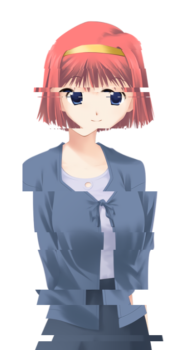
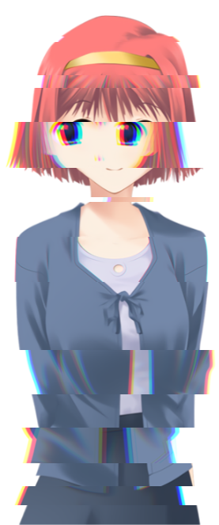
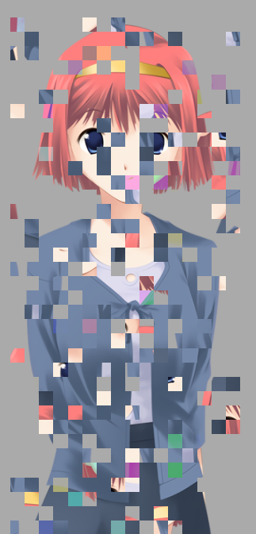

# renpy-ChromaGlitch
A way to display images (or other displayables, even animated) with a DDLC-like glitch effect offsetting slices of the image laterally and optionally adding chromatic aberration effects on the glitched slices.

These effects were featured in [this YouTube video](https://www.youtube.com/watch?v=H2eg010UozE) by Visual Novel Design. Thanks to him !




The `glitch.rpy` file contains the code itself.

## Howto glitch
`glitch` is a transform (because it takes a displayable and returns a displayable).
Its 6 parameters are :
- `child` : the displayable (~= image) on which the effect is applied. This is the only required argument, all others are keyword-only.
- `randomkey` : the key given to the random object used to generate the slices heights and offsets. This must match [the random module's specifications](https://docs.python.org/3/library/random.html#random.seed). A given image glitched with a given non-None key will always, always, be glitched the same way. A glitched image with a None key will look differently every time Ren'Py renders it - and re-renders can be triggered by a whole lot of things. Use this to make the glitching reliable (in an animation for example). Defaults to generating a random key at the first call and then sticking with it.
- `chroma` : boolean indicating whether or not to apply chromatic aberration effects to the glitched tranches. Defaults to True.
- `minbandheight` : minimum height of a slice, in pixels. Defaults to 1.
- `offset` : a positive integer. The actual offset given to a glitched slice will be comprised between -offset and +offset. Defaults to 30.
- `crop` : boolean indicating whether or not to crop the resulting image to make it fit the size of the original image. Defaults to False.

Then, you can directly show it using `show expression glitch("eileen happy") as beautifulcharacter` (I strongly recommand using the `as` clause).
You can also apply it as a transform, with `show eileen at glitch` or `show eileen at functools.partial(glitch, chroma=False)` or even `show layer master at glitch`.

It is also possible to define it directly as an image, simply using `image eileen glitched = glitch("eileen", offset=20)`
(it was not possible in previous versions of ChromaGlitch, but now it is).

Example :
```rpy
image eileen glitched:
    glitch("eileen happy") # reliable slicing
    pause 1.0
    glitch("eileen happy", offset=60, randomkey=None) # bigger and always-random slicing
    pause 0.1
    repeat
```

However, this last example using ATL will work poorly if and when "eileen happy" is itself an animation. This is because at the two lines starting with `glitch`, the child of the ATL animation is set again, and its animation timebase begins anew. This is (sadly for us) the expected behavior of ATL.
Luckily for us, there is...

## animated_glitch
`animated_glitch` is a transform working much like `glitch`, except that it overhauls the `randomkey` mechanism. That parameter is changed and updated at parameterizable intervals of time, alternating (though that can be disabled) between vanilla (non-glitched) and glitched versions of the transformed image. Given that it's the same image, same displayable all the time, it doesn't reset anything like the ATL solution above did, which makes it perfectly suitable for use over animations.
It takes the same parameters `glitch` does, plus the following ones :
- `timeout_base` : the time in seconds between two randomkey changes. Can either be a single float (or integer) value, or a tuple if two values between which the actual periods of time will be randomly chosen following a uniform distribution (which is `randomkey`-wise deterministic). Defaults to .1 second.
- `timeout_vanilla` : the same, for the periods of time during which the child image is shown without any glitching effect. If passed False, deactivates it - the image will always be glitched. If a `timeout_base` is passed, it default to that value, otherwise it defaults to `(1, 3)` (meaning a random duration each time, chosen randomly between 1 and 3 seconds).

The glitchless ("vanilla") phases, unless deactivated of course, are generated this way :
- the initial period is vanilla
- if one period was vanilla, the next is glitched
- if one period was glitched, the next has a 30% chance of being vanilla, otherwise it's glitched

## Squares glitch



This is a second type of glitch, which cuts the image into squares and does things to them.
It takes `child` and `randomkey`, which are the same as for the preceding glitch, and three aditional parameters.
- `squareside` : the size, in pixels, of the side of the squares the image will be cut to. This will be adjusted so that all the squares have the same size. Defaults to 20.
- `chroma` : the probability (0. - 1.) for each square to get a chromatic glitch. Defaults to .25.
- `permutes` : the percentage (0. - 1.) of squares which will change places with other squares. Defaults to a random percentage between 10% and 40%.

## Terms of use
Use it freely in any project. If you liked it, you can drop my name in the credits with a link to this repo 🥰
